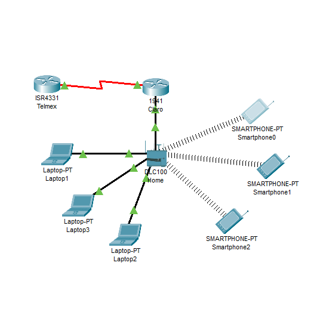
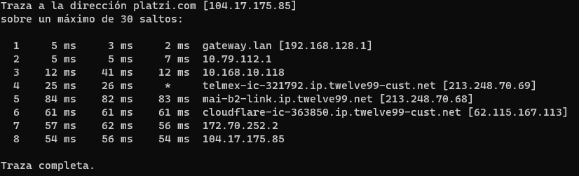

# Telematics

<p><code>Fundamentos de Telemática</code></p>
<p>Creado por <code>Giancarlo Ortiz</code> para explicar los fundamentos de los <code>Sistemas de comunicaciones</code> en los cursos de telemática y redes de computadores.</p>

# Practica de laboratorio 01

## Objetivos

### Objetivo General

Proporcionar el conocimiento y generar las habilidades necesarias en la configuración y gestión de dispositivos de redes.

### Objetivos Específicos

- Conocer los números necesarios para configurar y caracterizar los diferentes dispositivos de red. :+1:

---

## 1. [Configurar el entorno de trabajo](#) ✔

1. Instalar [VSCode][1_1]
2. Instalar [Git][1_2]
3. Crear una cuenta en [github][1_3]
4. Crear el repositorio en Github llamado <code>Redes-dos</code>
5. Instalar la [extension de github][1_4] para VScode
6. Agregar <code>Usuario</code> y <code>Correo</code> globalmente para Git.
7. Clonar el repositorio remoto desde VScode.

```bash
# Para agregar Usuario y Contraseña a GIT
$ git config --global user.name "John Doe"
$ git config --global user.email johndoe@example.com
```

[1_1]:https://code.visualstudio.com/download
[1_2]:https://git-scm.com/download/win
[1_3]:https://github.com/
[1_4]:https://marketplace.visualstudio.com/items?itemName=GitHub.vscode-pull-request-github

## 2. [Preguntas de conocimiento](#) ✔

<ol type="a">
<li>¿Cual es la dirección de red y de broadcast de un host que tiene una ip 192.168.10.10/30 .?</li>

- **Respuesta:**

        - Direccion de broadcast: 192.168.10.11
        - Direcicon de Red: 192.168.10.10

<li>¿Cuantos clientes puede tener la sub red 172.16.0.0/22?.</li>

- **Respuesta:**

        - Total hostss: 1024
        - Hosts usables: 1022

<li>¿Que clase y tipo de dirección es 10.10.10.0/24?.</li>

- **Respuesta:**

        - Clase A de tipo Privada

<li>¿Que información se puede inferir de la dirección 169.254.255.200/26?.</li>


- **Respuesta:**


        - Clase: B

        - Tipo: Privada

        - Total hosts: 64

        - Hosts usables: 62

## 3. [Caracterización de los adaptadores](#) ✔

|Parámetro||Valor|
|--|:--:|--:|
|Número de adaptadores Físicos|-->|2|
|Número de adaptadores Virtuales|-->|1|
|Tipo de Adaptador principal|-->|Ethernet|
|Fabricante del Adaptador principal|-->|Realtek|
|Código MAC del fabricante|-->|88-D7-F6|
|MAC|-->|88-D7-F6-DA-7A-33|

## 4. [Caracterización de la red](#) ✔

|Parámetro|Valor|
|--|--:|
|**Subnet**|192.168.254.0/24|
|IPv4|192.168.128.8|
|Subnet Mask decimal|24|
|Subnet Mask octetos|255.255.255.0|
|Número de direcciones de Host|3|
|Rango de direcciones de Host|192.168.128.1-254|
|IP Broadcast|192.168.0.255|
|Server DHCP|192.168.128.1|
|Server DNS|192.168.128.1|

>Nota: Para obtener los parámetros de la red, usaremos el comando [ipconfig][10] o [ifconfig][8].

## 5. [Caracterización de la puerta de enlace](#) ✔

|Parámetro|Valor|
|--|--:|
|Número de Entradas en la tabla ARP |11|
|IPv4 Gateway|192.168.128.1|
|MAC Gateway|88-D7-F6-DA-7A-33|
|ISP|Claro|
|[IP Publica][5]|181.62.52.121|
|Sistema Autónomo|AS14080|

>Nota: Para obtener los parámetros de la red, usaremos el comando [arp][11] y algún servicio web/HTTP.

## 6. [Retardo de la red](#) ✔

|Servidor|IP|Tiempo promedio/ms|
|--|--|--|
|DNS Google|8.8.8.8|19ms|
|DNS Cloudflare|1.1.1.1|51ms|
|OpenDNS|208.67.220.220|51ms|
|Alternate DNS|76.76.19.19|16ms|
|DNS Quad9|9.9.9.9|21ms|
|AdGuard DNS|104.18.10.132|55ms|

>Nota: Para calcular el retardo de la red, usaremos el protocolo ICMP/[ping][12] con al menos 10 paquetes.

## 7. [Capacidad del canal](#) ✔

|Servidor|Ping/ms|Down/MB|Up/MB|
|--|:--:|--:|--:|
|[speed test][1]|19|17|15|
|[Netflix][2]|8|38|64|
|[Claro][3]|15|32.75|33.67|
|[nperf][4]|32.70|31.14|34.11|

>Nota: Para calcular el retardo de la red, usaremos el protocolo HTTP via servicio WEB.

## 8. [Distancia desde el host](#) ✔

|Servidor|Ping/ms|Numero de Saltos|
|--|:--:|--:|
|google.com|16|8|
|GMail.com|15|8|
|YouTube.com|20|8|
|dns.google|18|8|
|aws.amazon.com|18|12|
|portal.azure.com|18|8|
|login.live.com|102|15|
|Facebook.com|17|8|
|c.ns.WhatsApp.net|92|14|
|claro.com.co|0|0|
|platzi.com|55|8|
|rappi.com.co|184|30|

>Nota: Para calcular el retardo de la red, usaremos el comando ICMP/[tracert][13].

## 9. [Diagrama de Red](#) ✔

1. Realice un diagrama topológico de la red que le ofrece conectividad a internet.

    

2. Incluya todos los detalles de la red de area local a la que se encuentra conectado.
    - **Respuesta:**

            - Red DHCP
            - 5G - 2.4G
            - Fast Eternet 1GB
3. Incluya los saltos conocidos incluyendo el equipo de borde de su ISP.

    

## 10. [Preguntas de conocimiento](#) ✔

1. Cual es la dirección de red y de broadcast de un host que tiene una ip 192.168.10.10/30.
    - **Respuesta:**

            - Direccion de broadcast: 192.168.10.11
            - Direcicon de Red: 192.168.10.10
2. Cuantos equipos o.
    - **Respuesta:**

            - Total hosts: 4
            - Hosts usables: 2
3. Incluya los saltos conocidos incluyendo el equipo de borde de su ISP.

    

[1]:https://www.speedtest.net/es
[2]:https://fast.com/es/#
[3]:http://speedtest.claro.net.co/
[4]:https://www.nperf.com/es/
[5]:https://www.cual-es-mi-ip.net/

[8]:https://man7.org/linux/man-pages/man8/ifconfig.8.html
[10]:https://learn.microsoft.com/es-es/windows-server/administration/windows-commands/ipconfig
[11]:https://learn.microsoft.com/es-es/windows-server/administration/windows-commands/arp
[12]:https://learn.microsoft.com/es-es/windows-server/administration/windows-commands/ping
[13]:https://learn.microsoft.com/es-es/windows-server/administration/windows-commands/tracert

---

## Mas Recursos

- [Protocolo Ipv4](https://es.wikipedia.org/wiki/IPv4) (Wikipedia)
- [Direccionamiento IP](https://es.wikipedia.org/wiki/Direcci%C3%B3n_IP) (Wikipedia)
- [Calculadora IP](https://www.calculator.net/ip-subnet-calculator.html) (Wikipedia)

---

## Evaluación y rúbrica

- Fecha máximo entrega: 05 de Mayo de 2023
- Hora de entrega: 11:59pm 
- Nota máxima: 5.0
- Número de actividades: 10
- Valor de cada actividad: 0.5
- Ponderación: 20%
- $\color{#DD69DD}{\text{...Carpe Diem}}$
